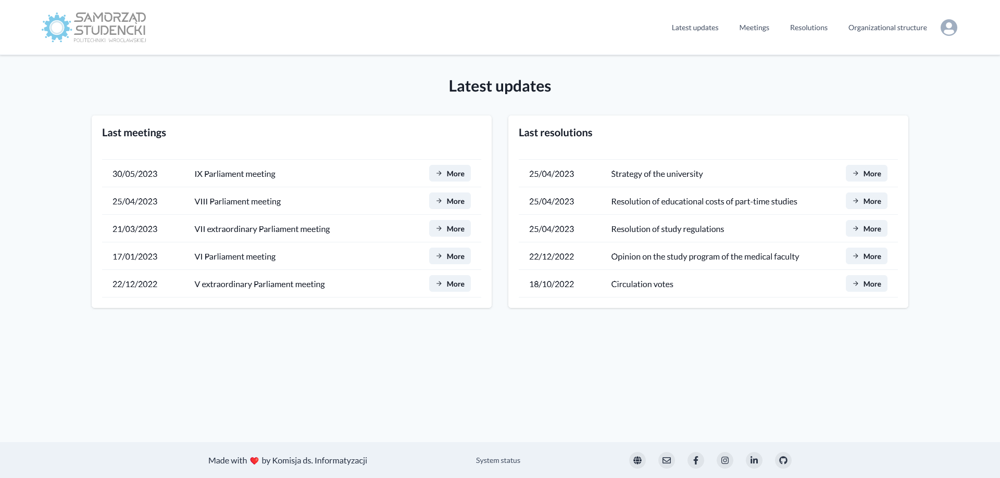

<br />
<br />
<p align="center">
  <a href="https://samorzad.pwr.edu.pl/">
    
  </a>
</p>
<h1 align="center">
  Parliamentary System 
</h1>
<p align="center">
  Web application for storing and relaying documents.
</p>
<p align="center"><a href="https://parlament.samorzad.pwr.edu.pl">Production link</a></p>

<p align="center">
  <a href="https://github.com/informatyzacja/parliamentary-system/actions">
    
  </a>
  <a title="Crowdin" target="_blank" href="https://informatyzacja.crowdin.com/parliamentary-system">
    
  </a>
  <a href="https://github.com/informatyzacja/parliamentary-system/releases">
    
  </a>
  <a href="https://status.samorzad.pwr.edu.pl/history/system-parlamentarny">
    
  </a>
  <a href="https://status.samorzad.pwr.edu.pl/history/system-parlamentarny-api">
    
  </a>
  <a href="https://github.com/informatyzacja/parliamentary-system/blob/main/LICENSE">
    
  </a>
</p>

<br>

<p>
  
</p>

## Getting started

### Installation

```shell
git clone https://github.com/informatyzacja/parliamentary-system.git
cd parliamentary-system
yarn install --immutable
```

### Requirements

#### Development

- Volta

#### Production

- Docker

### Deployment

Aby dokonać deployu projektu uruchom podane poniżej polecenia

```bash
docker compose -f docker-compose.yml up --force-recreate -V
```

## Environment Variables

Do uruchomienia projektu niezbędne jest uruchomienie poniższego kodu oraz ustawienie poniższych zmiennych

```bash
cp .env.example .env && cp api/.env.example api/.env && cp web/.env.example web/.env
```

#### .env

- `DATABASE_NAME`
- `DATABASE_USERNAME`
- `DATABASE_PASSWORD`
- `DATABASE_FOLDER`

#### api/.env

- `USOS_CLIENT_ID`
- `USOS_CLIENT_SECRET`

gdzie klucze do USOS uzyskasz od swojej uczelni

- `DATABASE_NAME`
- `DATABASE_USERNAME`
- `DATABASE_PASSWORD`

tak samo jak wyżej w `.env`

- `WEB_URL` - url frontendu

#### web/.env

- `NEXT_PUBLIC_API_URL` - url backendu
- `NEXTAUTH_URL` - url frontendu
- `NEXTAUTH_SECRET` - losowo wygenerowany sekret
- `GOOGLE_CLIENT_ID` - Google OAuth client id
- `GOOGLE_CLIENT_SECRET` - Google OAuth secret token
- `USOS_CLIENT_ID`
- `USOS_CLIENT_SECRET`

tak samo jak wyżej w `api/.env`

## Contributing

If you're having problems with running this project, feel free to create an issue!

Currently this project is maintained by a group of people chosen by Commission for IT of WUST's Students' Union and is not accepting pull requests from the outside.

## License

See the [LICENSE](./LICENSE) file for licensing information.
